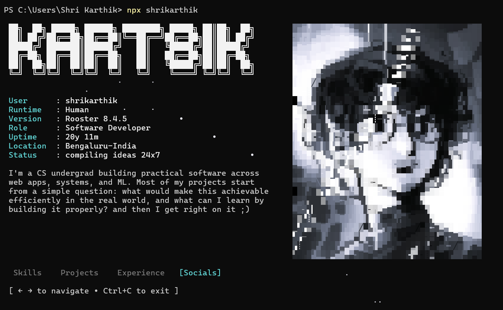

# shrikarthik

This is a **clean terminal portfolio that runs as an npm CLI package**.

That means instead of opening a website, u literally run in your terminal:

```bash
npx shrikarthik
```

…and the portfolio launches inside your terminal.

Built with:

* [React](https://react.dev)
* [Ink](https://github.com/vadimdemedes/ink)




---

# Try it

Run it instantly:

```bash
npx shrikarthik
```

No install needed.

npm page
[https://www.npmjs.com/package/shrikarthik](https://www.npmjs.com/package/shrikarthik)

github repo
[https://github.com/Kart8ik/portfolio-TUI](https://github.com/Kart8ik/portfolio-TUI)

---

# Terminal compatibility

This CLI uses:

* animated ANSI rendering
* Unicode block characters
* terminal redraw animations

So results depend on the terminal.

Works best in:

* Windows Terminal
* iTerm2
* Warp
* Kitty
* Alacritty
* GNOME Terminal

The default **macOS Terminal.app** sometimes glitches the portrait rendering.

If u see weird colors or broken blocks, try running it in a different terminal.

---

# Run locally (if u wanna see how it works)

Requirements:

* [Bun](https://bun.sh)

Clone the repo:

```bash
git clone https://github.com/Kart8ik/portfolio-TUI.git
cd portfolio-TUI
```

Install deps:

```bash
bun install
```

Run dev mode:

```bash
bun run dev
```

Build production bundle:

```bash
bun run build
bun run start
```

---

# Wanna fork this and publish your own CLI portfolio?

feel free to, thats the reason its public

Basic flow:

1. fork the repo
2. change the content (name, projects, etc), make it your own
3. publish to npm under your own package name
4. people can run:

```bash
npx yourname
```

pretty fun tbh.

---

# Step-by-step: publish your own version

### 1. Fork the repo

Fork it on GitHub, then clone your fork.

```bash
git clone https://github.com/YOURNAME/portfolio-TUI.git
cd portfolio-TUI
```

---

### 2. Change the package name

Open **package.json**.

Change:

```json
"name": "shrikarthik"
```

to something like:

```json
"name": "yourname"
```

This is the command users will run:

```bash
npx yourname
```

---

### 3. Check if your name is available on npm

Run:

```bash
npm view yourname
```

If npm returns **404**, the name is free.

If it prints package info, someone already took it.

---

### 4. Build the CLI

```bash
bun run build
```

This generates:

```
dist/cli.js
```

Which is the actual CLI entry point.

---

### 5. Create an npm account

If u don’t have one:

[https://www.npmjs.com/signup](https://www.npmjs.com/signup)

Then login from terminal:

```bash
npm login
```

---

### 6. Important: enable 2FA

New npm accounts often **require 2FA to publish**.

go to your npm profile and enable it there

Otherwise publishing might fail with a **403 error**.

Ik this one got me too.

---

### 7. Publish your package

Run:

```bash
npm publish --access public
```

If everything works you'll see:

```
+ yourname@1.0.0
```

you might have to tweak it multiple times, so to increase the package version:

```bash
npm version patch
```
---

### 8. Test it

Now anyone can run:

```bash
npx yourname
```

And your terminal portfolio launches.

Pretty cool moment ngl.

---

# Issues u might run into

### npm publish 403 error

Usually means:

* 2FA not enabled
* auth token issue

Fix:

```
enable 2FA
re-login with npm login
```

---

### package name already taken

Run:

```bash
npm view name
```

If it exists, pick another name.

npm names are **first come first serve**.

---

### CLI works locally but fails with npx

Usually a **bundling issue**.

Run:

```bash
bun run build
```

and make sure the output is:

```
dist/cli.js
```

And your `package.json` contains:

```json
"bin": {
  "yourname": "dist/cli.js"
}
```

# Scripts

| Script           | Command                      |
| ---------------- | ---------------------------- |
| `dev`            | Run with hot reload          |
| `build`          | Compile to `dist/cli.js`     |
| `start`          | Run built output             |
| `prepublishOnly` | Runs build before publishing |

---

# Why a CLI portfolio?

Most dev portfolios are websites.

and i've never really seen a portfolio as an npm package, so

```
npx yourname
```

felt cooler.

If u fork this and ship your own version, lmk, I’d love to see it :)
